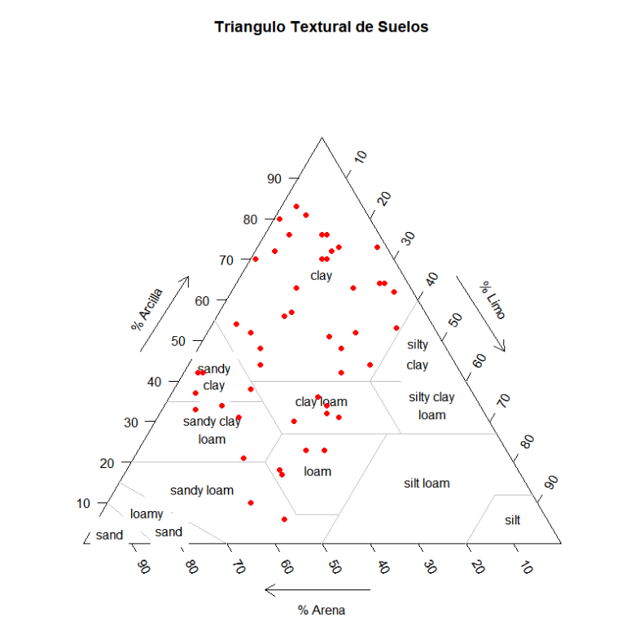
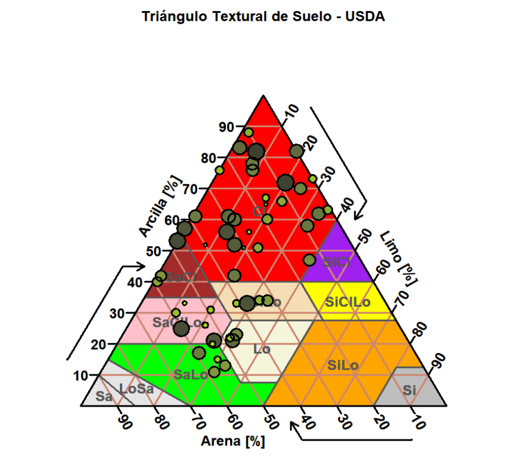
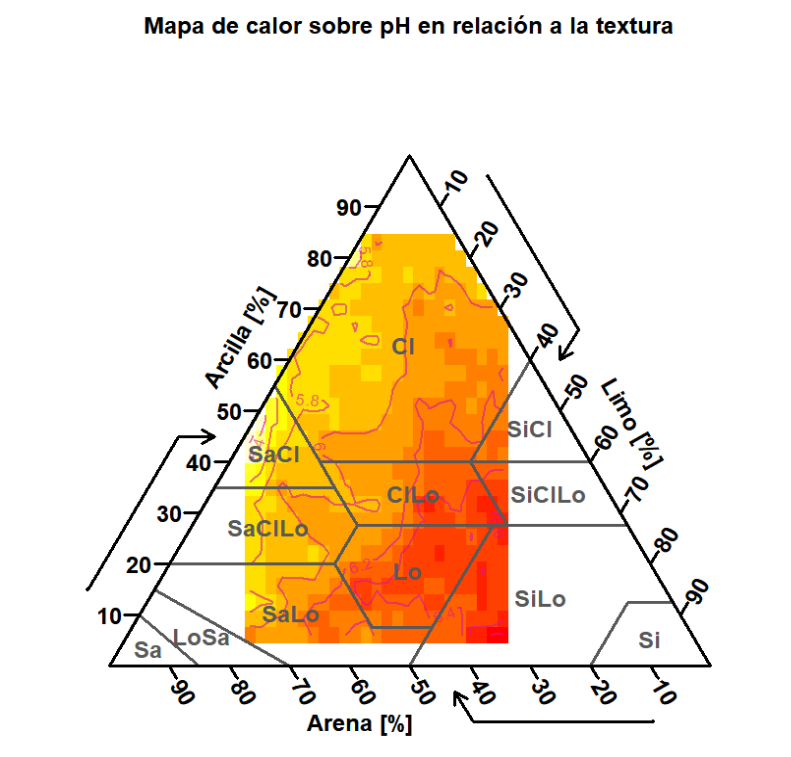

# Textura de Suelos - Gráficos

En el presente repositorio se muestra el procedimiento a seguir para generar diversos gráficos ternarios en donde se incluyen tres variables, en esta oportunidad esta enfocado a datos de textura de suelos. Partiendo de valores porcentuales de contenidos de arena, limo y arcilla se logran generar estos gráficos, para ello nos apoyamos de los paquetes de [plotrix](https://cran.r-project.org/web/packages/plotrix/index.html) y [soiltexture]().

