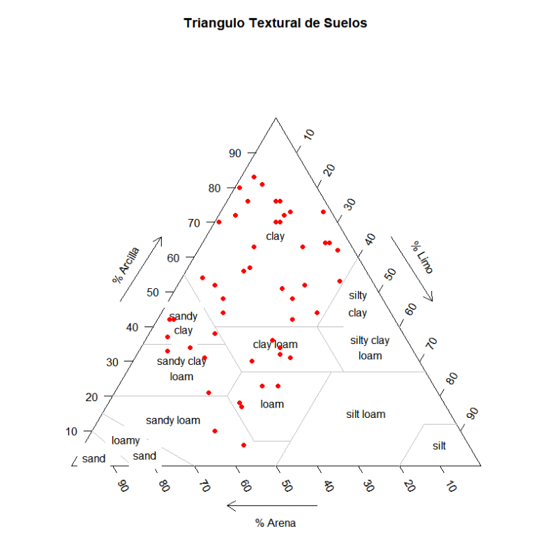
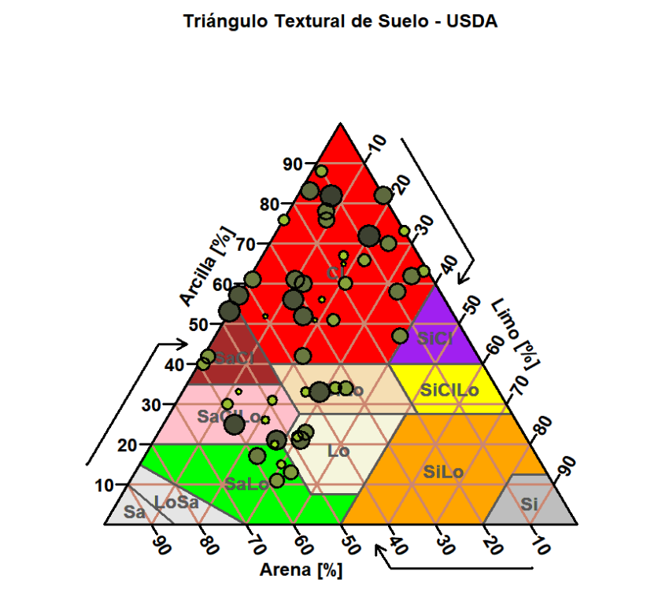
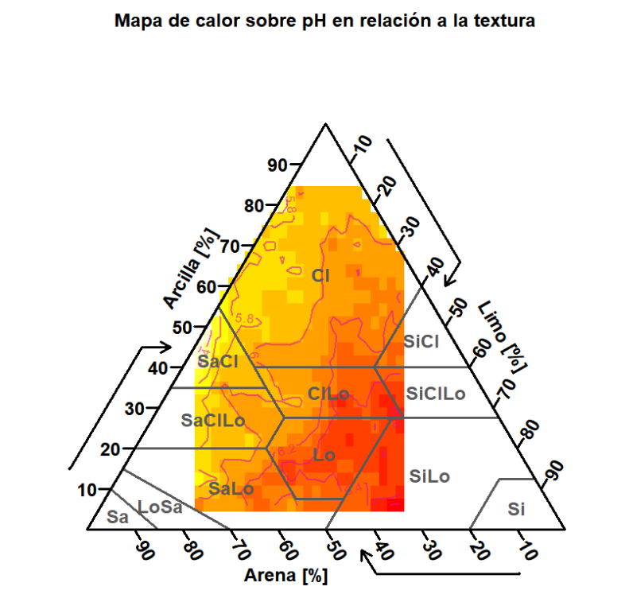

# Textura de Suelos - Gráficos

En el presente repositorio se muestra el procedimiento a seguir para generar diversos gráficos ternarios en donde se incluyen tres variables, en esta oportunidad esta enfocado a datos de textura de suelos. Partiendo de valores porcentuales de contenidos de arena, limo y arcilla se logran generar estos gráficos, para ello nos apoyamos de los paquetes de [plotrix](https://cran.r-project.org/web/packages/plotrix/index.html), [soiltexture](https://cran.r-project.org/web/packages/soiltexture/index.html) y [ggtern](https://cran.r-project.org/web/packages/ggtern/index.html).

## Paquetes utilizados

- **plotrix**: Proporciona funciones simples para crear triángulos texturales USDA
- **soiltexture**: Especializado en clasificaciones de textura de suelos con múltiples sistemas internacionales
- **ggtern**: Extensión de ggplot2 para crear diagramas ternarios modernos y altamente personalizables

